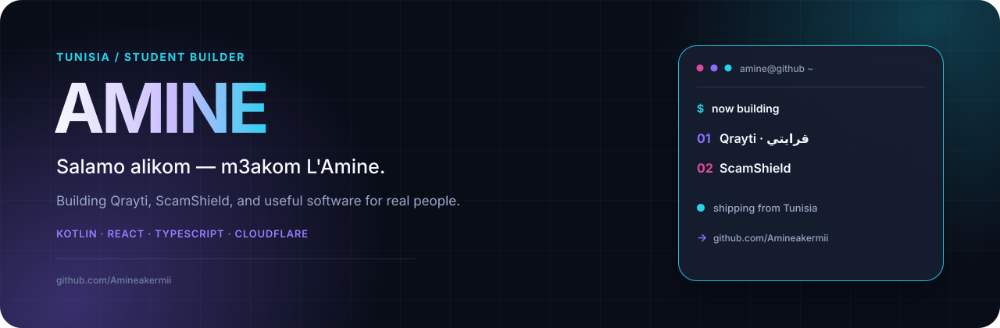

  

  <a href="https://www.instagram.com/amine.akermii/">Instagram</a> ·
  <a href="https://github.com/Amineakermii/Qrayti">Qrayti</a> ·
  <a href="https://github.com/Amineakermii/scamshield">ScamShield</a>

## What I'm building

### [Qrayti · قرايتي](https://github.com/Amineakermii/Qrayti)

A student-first learning platform made for university life in Tunisia. It brings course discovery, native readers, offline downloads, favourites, semester calculations, and beginner programming games into one Arabic-first Android experience.

**Kotlin · Jetpack Compose · Cloudflare Pages · D1 · R2** 
[Live website](https://qrayti.pages.dev) · [Download Android](https://qrayti.pages.dev/api/android) · [View source](https://github.com/Amineakermii/Qrayti)

### [ScamShield](https://github.com/Amineakermii/scamshield)

A privacy-first phishing and scam warning tool. It analyzes suspicious messages and URLs locally, gives an explainable risk score, and shows exactly which warning signs were found—without visiting submitted links.

**React · TypeScript · Vite · Vitest** 
[View source](https://github.com/Amineakermii/scamshield) · [Read the security review](https://github.com/Amineakermii/scamshield/blob/main/docs/security-review.md)

## How I like to build

I start with real problems, keep the interface understandable, and try to ship the whole thing—not just a demo screen. My current work moves between native Android, web interfaces, small security tools, and Cloudflare infrastructure.

## Elsewhere

I'm **[@amineakermii](https://www.instagram.com/amineakermii/)** on Instagram.
